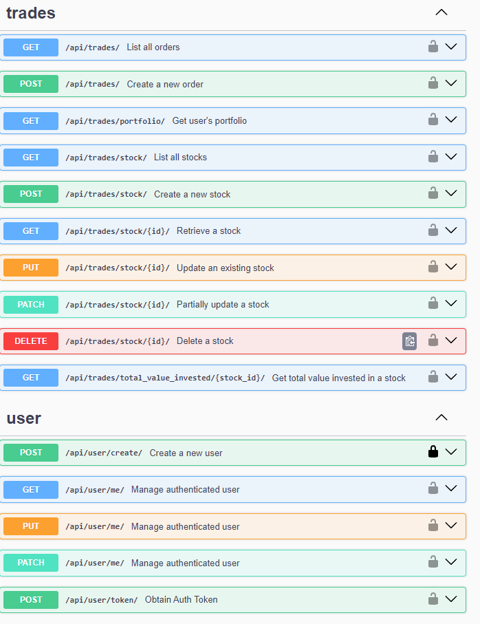

# DRF-Trading

## Setup

1. Clone the repository:
   ```bash
   git clone https://github.com/bob134552/DRF-Trading.git
   cd trading_app
2. Install dependencies:
    ```bash
    pip install -r requirements.txt
* Adjust environment settings to store the following environment variables:
    - SECRET_KEY (can be generated from any keygen app [example](https://djecrety.ir))
3. Run migrations:
    ```bash
    python manage.py makemigrations
    python manage.py migrate
4. Create a superuser:
    ```bash
    python manage.py createsuperuser
5. Run the server
    ```bash
    python manage.py runserver
6. Create Stock model instances by navigating to the admin page and clicking Stock and add new model to add example Stock models.

7. Schedule cron job:
    ```bash
    python manage.py crontab add
## Models

#### Stock Model

|Name|Key|Description|Field Type|
|:---|:----:|:----:|---:|
|Name|name|max_length=100, blank=False, null=False|CharField|
|Price|price|max_digits=10, decimial_places=2, blank=False, null=False|DecimalField|

#### Order Model

|Name|Key|Description|Field Type|
|:---|:----:|:----:|---:|
|User|user|User, on_delete=models.CASCADE, blank=False, null=False|ForeignKey|
|Stock|stock|Stock, on_delete=models.CASCADE, blank=False, null=False|ForeignKey|
|Order Type|order_type|max_length=4, choices=ORDER_CHOICES, null=False, blank=False|CharField|
|Quantity|quantity|null=False, blank=False|PositiveIntegerField|
|Date and time placed|date_time_placed|auto_now_add=True|DateTimeField|

## Running Tests

Tests can be run by using the following command.

```
python manage.py test

or if testing specific apps

python manage.py test <app name>
```

## API Endpoints

The endpoints available are as follows:

    - Trades
        - /api/trades/  (GET, POST)
            GET: Retrives all orders placed by the user.
            POST: Places an order for the user.
        - /api/trades/portfolio/  (GET)
            GET: Retrieve the portfolio of the authenticated user, showing the total quantity and value of each stock they hold
        - /api/trades/total_value_invested/{stock_id}/ (GET)
            GET: Retrieve the net total value invested by the authenticated user in a specific stock, considering buy and sell orders.

    - User
        - /api/user/create/ (POST)
            POST: Endpoint for registering a new user in the system. Requires user details like username, email, password, etc.
        - /api/user/me/ (GET, PUT, PATCH)
            GET: Retrieves the users information.
            PUT, PATCH: Updates the users information.
        - /api/user/token/ (POST)
            POST: Generates an authentication token for the user, requiring an email and password. (Note: to authenticate and be able to use the API append Token to the start of the generated token i.e. "Token <generated token>")

In addition while running the user can visit /api/docs to view an interactive page allowing a user to test each of the above endpoints.
